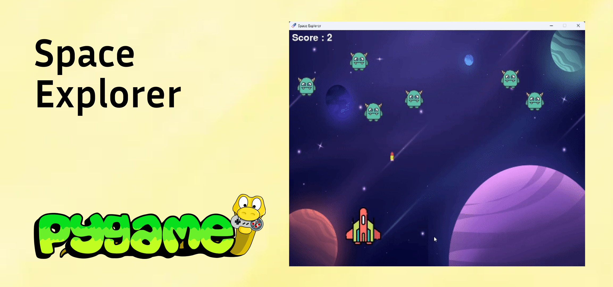

# 🚀 Space Explorer Game



**A classic space shooter game made using Python and Pygame. Blast enemies, dodge attacks, and keep climbing the score!**

[](https://www.python.org/) [](https://www.pygame.org/) 

---

# 🎮 Features

- Smooth spaceship control using keyboard arrows and spacebar
- Randomized enemy generation and smart horizontal movement
- Collision detection between bullets and enemies
- Score tracking system 🧮
- Game Over condition when enemies break the line
- Background music and sound effects for immersive gameplay
- Continuous gameplay loop that handles all logic, movement, and display updates

---

# 🧠 Game Mechanics

### 🔧 Initialization and Setup
- The Pygame library is initialized.
- Game screen is set up with a custom background and icon.

### 🖼️ Images and Sounds
- Includes graphics for:
  - Player spaceship 🛸
  - Enemies 👾
  - Background 🌌
- Audio assets:
  - Bullet firing 🔫
  - Enemy explosion 💥

### 🎮 Player Control
- Left and Right Arrow Keys: Move the spaceship horizontally.
- Spacebar: Shoot bullets upward.

### 👾 Enemy Generation and Movement
- Enemies appear in randomized horizontal positions.
- They move side to side, reversing direction at screen edges.

### 💥 Collision Detection
- When a bullet hits an enemy, both disappear.
- Explosion sound plays and score increases.

### 🧮 Scoring
- Points awarded for each enemy destroyed.
- Score is continuously updated and displayed.

### ❌ Game Over
- If any enemy reaches the bottom (crosses player line), the game ends.
- A **"Game Over"** message is displayed.

### 🔁 Main Game Loop
- Handles all gameplay:
  - Input events
  - Position updates
  - Collision checks
  - Drawing visuals
  - Playing sounds

---

# 🖥️ Tech Stack

- **Language:** Python 🐍
- **Framework:** Pygame 🎮

---

# 📦 Requirements

```bash
pip install pygame
```
# Run the Game

```bash
python space_explorer.py
```

# 🤝 Contribution

Contributions are welcome! If you have suggestions, improvements, or bug fixes follow this steps.

1. please open an issue.
2. Fork the repository.
3. Create a new branch (feature-branch)
4. Commit your changes.
5. Push to the branch and submit a pull request.

# 📬 Contact

For any issues or suggestions, open an issue or reach out at this avniprajapati21101@gamil.com
